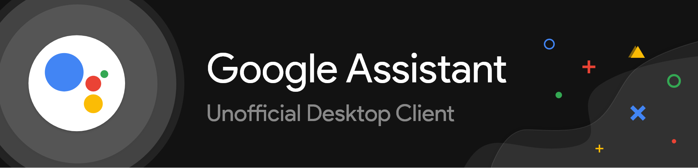
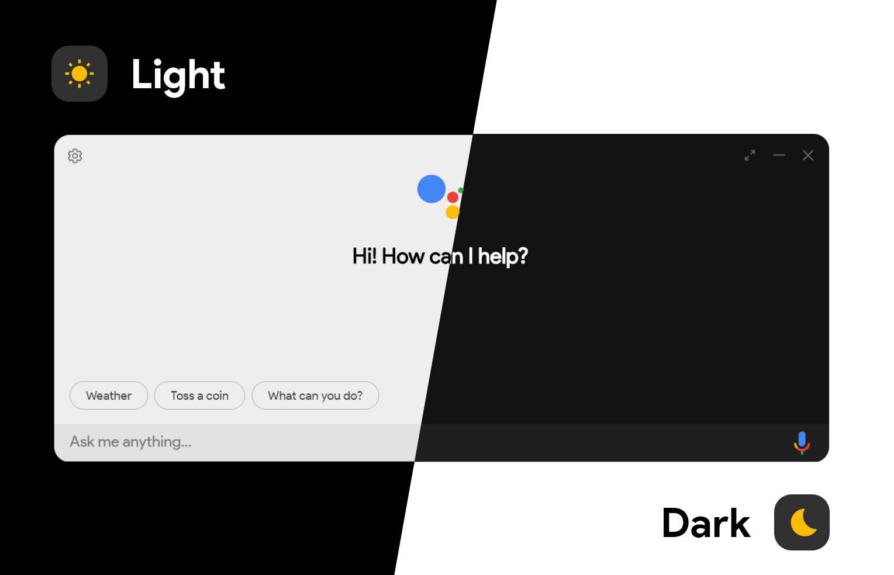

# Google Assistant Unofficial Desktop Client

[][build]
[][dependencies]
[][downloads]
[][issues]
[][license]
[][top-lang]
[][commits]
[][commits]



Google Assistant Unofficial Desktop Client is a cross-platform desktop client for Google Assistant based on **Google Assistant SDK**.

> Note:
> ---
>
> The **"Google Assistant Unofficial Desktop Client"** is under development. So, if you find any bugs or have any suggestion, feel free to post an _issue_ or a _pull request_.

## Inspiration

The design is inspired by Google Assistant in Chrome OS and comes in both Light Mode _(beta)_ and Dark Mode 😉.



## Getting Started

In order to use the client, you must have a _"Key File"_ and _"Token"_ for authentication which you can get by going through **Device Registration** process. You can go through the wiki given below to get started.

"*Setup Authentication for Google Assistant Unofficial Desktop Client*" Wiki (For both **Device Registration** & **Authentication** help):
> https://github.com/Melvin-Abraham/Google-Assistant-Unofficial-Desktop-Client/wiki/Setup-Authentication-for-Google-Assistant-Unofficial-Desktop-Client

#### Other References

If you want a user friendly registration method, use **Device Registration** UI:
> https://developers.google.com/assistant/sdk/guides/library/python/embed/config-dev-project-and-account

If you want to use a CLI tool to complete the **Device Registration** and **Authentication** process manually, read the following:
> https://developers.google.com/assistant/sdk/reference/device-registration/register-device-manual

After you have registered your device and downloaded the required authentication files, you can head on to _Settings_ and set the _"Key File Path"_ and _"Saved Tokens Path"_ to the location where the respective files are located.

## How to Build?

### Using `npm`
---------------

```bash
# Get dependencies from npm
npm install

# Run the Assistant
npm start

# Build the Assistant
npm run dist
```

### Using `yarn`
----------------

```bash
# Get dependencies from npm registry
yarn install

# Run the Assistant
yarn start

# Build the Assistant
yarn dist
```

## Download

If you don't want to build the project for yourself, you can download the Assistant Setup/Installer for the respective platform from [here (releases)](https://github.com/Melvin-Abraham/Google-Assistant-Unofficial-Desktop-Client/releases)

## Keyboard Shortcut

* **Windows:** Win + Shift + A
* **MacOS:** Cmd + Shift + A
* **Linux:** Super + Shift + A

## TODO

- [x] Set `build` for Mac and Linux in _package.json_
- [x] Create Config File
- [x] Remove 'auth' from the `app` folder
- [ ] Respond to "Ok Google" or "Hey Google"
- [x] Activate Mic for `continuousConverstion` only when audio output is done
- [x] Use different dependency for audio recording
- [ ] Improve Carousel UI Rendering in the `main_area`
- [x] Improve Error Handling
- [x] Improve Assistant Audio Output
- [x] Turn off `webAudio` after visualization
- [x] "Enable Audio Output" in Settings
- [x] Divide Settings into sections
- [x] Don't accept empty queries
- [x] Info for each Setting
- [x] Animation while talking
- [x] Ping when activating mic
- [x] Welcome screen for first-time users
- [x] Display images from Google Images
- [x] Option to disable auto-scaling
- [x] Cleanup CSS
- [x] Remove `sox` as a dependency

## Other Libraries Used

* **p5.js:** 
  * For visualization purpose when the user speaks through mic.
  * Link: https://p5js.org/

* **aud_player.js:**
  * For playing audio through speakers.
  * Link: https://github.com/ItsWendell/google-assistant-desktop-client/blob/develop/src/renderer/providers/assistant/player.js

* **microphone.js:**
  * For recording audio using Web API.
  * Link: https://github.com/ItsWendell/google-assistant-desktop-client/blob/develop/src/renderer/providers/assistant/microphone.js

[downloads]: <https://github.com/Melvin-Abraham/Google-Assistant-Unofficial-Desktop-Client/releases>
[issues]: <https://github.com/Melvin-Abraham/Google-Assistant-Unofficial-Desktop-Client/issues>
[build]: <https://travis-ci.org/github/Melvin-Abraham/Google-Assistant-Unofficial-Desktop-Client>
[license]: <https://www.apache.org/licenses/LICENSE-2.0>
[commits]: <https://github.com/Melvin-Abraham/Google-Assistant-Unofficial-Desktop-Client/commits/master>
[top-lang]: <https://github.com/Melvin-Abraham/Google-Assistant-Unofficial-Desktop-Client>
[dependencies]: <https://github.com/Melvin-Abraham/Google-Assistant-Unofficial-Desktop-Client/blob/master/package.json>
